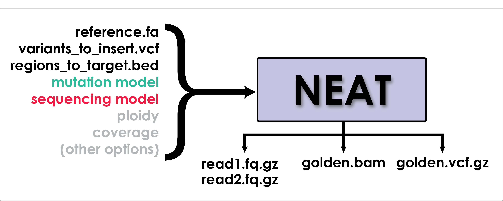

# The NEAT Project v4.3.5

Welcome to the NEAT project, the NExt-generation sequencing Analysis Toolkit, version 4.3.5. This release of NEAT 4.3.5 includes several fixes and a little bit of restructuring, including a parallel process for running `neat read-simulator`. Our tests show much improved performance. If the logs seem excessive, you might try using the `--log-level ERROR` to reduce the output from the logs. See the [ChangeLog](ChangeLog.md) for notes. NEAT 4.3.5 is the official release of NEAT 4.0. It represents a lot of hard work from several contributors at NCSA and beyond. With the addition of parallel processing, we feel that the code is ready for production, and future releases will focus on compatibility, bug fixes, and testing. Future releases for the time being will be enumerations of 4.3.X.

## NEAT v4.3.5
Neat 4.3.5 marked the officially 'complete' version of NEAT 4.3, implementing parallelization. To add parallelization to you run, simply add the "threads" parameter in your configuration and run read-simulator as normal. NEAT will take care of the rest. You can customize the parameters in you configuration file, as needed.

We have completed major revisions on NEAT since 3.4 and consider NEAT 4.3.5 to be a stable release, in that we will continue to update and provide bug fixes and support. We will consider new features and pull requests. Please include justification for major changes. See [contribute](CONTRIBUTING.md) for more information. If you'd like to use some of our code in your own, no problem! Just review the [license](LICENSE.md), first.

NEAT's read-simulator is a fine-grained read simulator. It simulates real-looking data using models learned from specific datasets. There are several supporting utilities for generating models used for simulation and for comparing the outputs of alignment and variant calling to the golden BAM and golden VCF produced by NEAT.

We've deprecated NEAT's command-line interface options for the most part, opting to simplify things with configuration files. If you require the CLI for legacy purposes, NEAT 3.4 was our last release to be fully command-line interface. Please convert your CLI commands to the corresponding yaml configuration for future runs.

To cite this work, please use:

> Stephens, Z. D., Hudson, M. E., Mainzer, L. S., Taschuk, M., Weber, M. R., & Iyer, R. K. (2016). Simulating Next-Generation Sequencing Datasets from Empirical Mutation and Sequencing Models. _PLOS ONE_, _11_(11), e0167047. https://doi.org/10.1371/journal.pone.0167047

## Table of Contents

* [The NEAT Project v4.3.5](#the-neat-project-v435)
* [NEAT v4.3.5](#neat-v435)
* [Table of Contents](#table-of-contents)
  * [Prerequisites](#prerequisites)
  * [Installation](#installation)
  * [Usage](#usage)
  * [Functionality](#functionality)
  * [Examples](#examples)
    * [Whole genome simulation](#whole-genome-simulation)
    * [Targeted region simulation](#targeted-region-simulation)
    * [Insert specific variants](#insert-specific-variants)
    * [Single-end reads](#single-end-reads)
    * [Large single-end reads](#large-single-end-reads)
    * [Parallelizing simulation](#parallelizing-simulation)
  * [Utilities](#utilities)
    * [`neat model-fraglen`](#neat-model-fraglen)
    * [`neat gen-mut-model`](#neat-gen-mut-model)
    * [`neat model-seq-err`](#neat-model-seq-err)
    * [`neat vcf_compare`](#neat-vcf_compare)
    * [Note on Sensitive Patient Data](#note-on-sensitive-patient-data)

## Prerequisites

The most up-to-date requirements are found in `environment.yml`.

* Some version of Anaconda to set up the environment
* `python` == 3.10.*
* `poetry` == 1.3.*
* `biopython` == 1.85
* `pkginfo`
* `matplotlib`
* `numpy`
* `pyyaml`
* `scipy`
* `pysam`
* `frozendict`

NEAT assumes a Linux environment and was tested primarily on Ubuntu Linux. It should work on most Linux systems. If you 
use another operating system, please install WSL or a similar tool to create a Linux environment to operate NEAT from.
For setting up NEAT, you will need `Anaconda` (or `miniconda`). The method described here installs NEAT as a base package 
in the active `conda` environment, so whenever you want to run NEAT, you can first activate the environment, then run
from any place on your system. If you desire VCF files, please install also `bcftools`. For your convenience, we have
added `bcftools` to the environment file, as it is available from `conda`. You may remove this line if you do not want or 
need VCF files with the variants NEAT added.

## Installation
To install NEAT, you must create a virtual environment using a tool such as `conda`. Once activated, you can
use the `poetry` module in build a wheel file, which can then be `pip` installed. 

First, clone the environment and move to the NEAT directory:

```bash
$ git clone git@github.com:ncsa/NEAT.git 
$ cd NEAT
```

You will need to run these
commands from within the NEAT directory:

```bash
(base) $ conda env create -f environment.yml
(base) $ conda activate neat
(neat) $ poetry build
(neat) $ pip install dist/neat*whl
```

Assuming you have installed `conda`, run `source activate` or `conda activate`.

Please note that these installation instructions support MacOS, Windows, and Linux. However, if you are on MacOS, you need to remove the line `libgcc=14` from `environment.yml`. A solution for some non-Linux users is simple to remove the version specification (e.g., `libgcc`).

An quick form of installation uses `bioconda`. Once `conda` is installed, the following command can be run for easy setup:

```bash
(base) $ conda create -n neat -c conda-forge -c bioconda neat
(base) $ conda activate neat
```

After completing installation, you can now run NEAT as a command line tool directly:
`neat --help`

Alternatively, if you wish to work with NEAT in the development environment, you can use poetry install within
the NEAT repo, after creating the conda environment:

```bash
$ conda env create -f environment.yml
$ conda activate neat
$ poetry install
```

Any updates to the NEAT code will be instantly reflected with a `poetry install` version.

Notes: If any packages are struggling to resolve, check the channels and try to manually `pip` install the package to see 
if that helps (but note that NEAT is not tested on the `pip` versions). If `poetry` hangs for you, try the following fix 
(from https://github.com/python-poetry/poetry/issues/8623):

```bash
export PYTHON_KEYRING_BACKEND=keyring.backends.null.Keyring
```
Then, re-run `poetry install`.

Test your install by running:
```bash
$ neat --help
```

You can also try running it using the python command directly:
```bash
$ python -m neat --help
```

## Usage
NEAT's core functionality is invoked using the `read-simulator` command. Here's the simplest invocation of read-simulator using default parameters. This command produces a single-ended FASTQ file with reads of length 151, ploidy 4, coverage 15x, default sequencing substitution, and default mutation rate models.

Contents of `neat_config.yml`:
```yml
reference: /path/to/my/genome.fa
read_len: 151
ploidy: 4
coverage: 15
```

```bash
neat read-simulator -c neat_config.yml -o simulated_data
```

The `--output` (`-o`) option sets the folder to place output data. If the folder does not exist, Python will attempt to create it. To specify a common filename prefix, you can additionally add the `--prefix` (`-p`), e.g., `-p ecoli_20x` will result in output files `ecoli_20x.fastq.gz`, `ecoil_20x.vcf.gz`, etc.

A config file is required. The config is a `.yml` file specifying the input parameters. The following is a brief
description of the potential inputs in the config file. See `NEAT/config_template/template_neat_config.yml` for a template config file to copy and use for your runs. It provides a detailed description of all the parameters that NEAT uses.

To run the simulator in multithreaded mode, set the `threads` value in the config to something greater than 1.

`reference`: full path to a fasta file to generate reads from.  
`read_len`: The length of the reads for the fastq (if using). _Integer value, default 101._    
`coverage`: desired coverage value. _Float or integer, default = 10._    
`ploidy`: Desired value for ploidy (# of copies of each chromosome in the organism). _Default is 2._    
`paired_ended`: If paired-ended reads are desired, set this to True. Setting this to true requires either entering values for fragment_mean and fragment_st_dev or entering the path to a valid fragment_model.    
`fragment_mean`: Use with paired-ended reads, set a fragment length mean manually    
`fragment_st_dev`: Use with paired-ended reads, set the standard deviation of the fragment length dataset

The following values can be set to true or omitted to use defaults. If True, NEAT will produce the file type.
The default is given:

`produce_bam`: False    
`produce_vcf`: False    
`produce_fastq`: True    

`error_model`: full path to an error model generated by NEAT. Leave empty to use default model _(default model based on human, sequenced by Illumina)._     
`mutation_model`: full path to a mutation model generated by NEAT. Leave empty to use a default model _(default model based on human data sequenced by Illumina)._     
`fragment_model`: full path to fragment length model generate by NEAT. Leave empty to use default model _(default model based on human data sequenced by Illumina)._

`threads`: The number of threads for NEAT to use. _Increasing the number will speed up read generation._
`avg_seq_error`: average sequencing error rate for the sequencing machine. Use to increase or decrease the rate of errors in the reads. _Float between 0 and 0.3. Default is set by the error model._    
`rescale_qualities`: rescale the quality scores to reflect the avg_seq_error rate above. Set True to activate if you  notice issues with the sequencing error rates in your datatset.    
`include_vcf`: full path to list of variants in vcf format to include in the simulation. These will be inserted as they appear in the input VCF into the final VCF, and the corresponding fastq and bam files, if requested.    
`target_bed`: full path to list of regions in bed format to target. All areas outside these regions will have coverage of 0.    
`discard_bed`: full path to a list of regions to discard, in BED format.
`mutation_rate`: Desired rate of mutation for the dataset. _Float between 0.0 and 0.3 (default is determined by the mutation model)._    
`mutation_bed`: full path to a list of regions with a column describing the mutation rate of that region, as a float with values between 0 and 0.3. The mutation rate must be in the third column as, e.g., mut_rate=0.00.    
`rng_seed`: Manually enter a seed for the random number generator. Used for repeating runs. _Must be an integer._    
`min_mutations`: Set the minimum number of mutations that NEAT should add, per contig. _Default is 0._ We recommend setting this to at least one for small chromosomes, so NEAT will produce at least one mutation per contig.
`threads`: Number of threads to use. More than 1 will use multithreading parallelism to speed up processing.
`mode`: 'size' or 'contig' whether to divide the contigs into blocks or just by contig. By contig is the default, try by size. Varying the size parameter may help if default values are not sufficient.
`size`: Default value of 500,000.
`cleanup_splits`: If running more than one simulation on the same input fasta, you can reuse splits files. By default, this will be set to False, and splits files will be deleted at the end of the run.
`reuse_splits`: If an existing splits file exists in the output folder, it will use those splits, if this value is set to True.

The command line options for NEAT are as follows:

Universal options can be applied to any subfunction. The commands should come before the function name (e.g., neat --log-level DEBUG read-simulator ...), except -h or --help, which can appear anywhere in the command.
| Universal Options   | Description                          |
|---------------------|--------------------------------------|
| -h, --help          | Displays usage information           |
| --no-log            | Turn off log file creation           |
| --log-name LOG_NAME | Custom name for log file, can be a full path (default is current working directory with a name starting with a timestamp)|
| --log-level VALUE   | VALUE must be one of [DEBUG, INFO, WARN, WARNING, ERROR] - sets level of log to display |
| --log-detail VALUE   | VALUE must be one of [LOW, MEDIUM, HIGH] - how much info to write for each log record |
| --silent-mode       | Writes logs, but suppresses stdout messages |

read-simulator command line options
| Option              | Description                         |
|---------------------|-------------------------------------|
| -c VALUE, --config VALUE | The VALUE should be the name of the config file to use for this run |
| -o OUTPUT_DIR, --output_dir OUTPUT_DIR | The path to the directory to write the output files |
| -p PREFIX, --prefix String | The prefix for file names |

## Functionality



NEAT produces simulated sequencing datasets. It creates FASTQ files with reads sampled from a provided reference genome, using sequencing error rates and mutation rates learned from real sequencing data. The strength of NEAT lies in the ability for the user to customize many sequencing parameters, produce 'golden,' true-positive datasets. We are working on expanding the functionality even further to model more species, generate larger variants, model tumor/normal data, and more!

Features:

- Simulate single-end and paired-end reads 
- Custom read length
- Can introduce random mutations and/or mutations from a VCF file
  - Supported mutation types include SNPs, indels (of any length), inversions, translocations, duplications
  - Can emulate multi-ploid heterozygosity for SNPs and small indels
- Can simulate targeted sequencing via BED input specifying regions to sample from
- Can accurately simulate large, single-end reads with high indel error rates (PacBio-like) given a model
- Specify simple fragment length model with mean and standard deviation or an empirically learned fragment distribution
- Simulates quality scores using either the default model or empirically learned quality scores using `neat gen_mut_model`
- Introduces sequencing substitution errors using either the default model or empirically learned from utilities/
- Output a VCF file with the 'golden' set of true positive variants. These can be compared to bioinformatics workflow output (includes coverage and allele balance information)
- Output a BAM file with the 'golden' set of aligned reads. These indicate where each read originated and how it should be aligned with the reference
- Create paired tumour/normal datasets using characteristics learned from real tumour data

## Examples

The following commands are examples for common types of data to be generated. The simulation uses a reference genome in fasta format to generate reads of 126 bases with default 10X coverage. Outputs paired fastq files, a BAM file and a VCF file. The random variants inserted into the sequence will be present in the VCF and the reads will show their proper alignment in the BAM. Unless specified, the simulator will also insert some "sequencing error"—random variants in some reads that represents false positive results from sequencing.

### Whole genome simulation
Simulate whole genome dataset with random variants inserted according to the default model:

```
[contents of neat_config.yml]
reference: hg19.fa
read_len: 126
produce_bam: True
produce_vcf: True
paired_ended: True
fragment_mean: 300
fragment_st_dev: 30

neat read-simulator                 \
        -c neat_config.yml          \
        -o /home/me/simulated_reads/
```

### Targeted region simulation
Simulate a targeted region of a genome (e.g., an exome) with a targeted bed:

```
[contents of neat_config.yml]
reference: hg19.fa
read_len: 126
produce_bam: True
produce_vcf: True
paired_ended: True
fragment_mean: 300
fragment_st_dev: 30
targed_bed: hg19_exome.bed

neat read-simulator                 \
        -c neat_config              \
        -o /home/me/simulated_reads/

```
### Parallelizing simulation
In this case, you would want to split the contig into blocks, rather than reading by contig. Even in single-threaded mode, this is likely to be faster. The default block size of 500,000 yields results quickly on a variety of datasets and can be easily modified to meet your requirements.

Also, we demonstrate the situation where you do not want any logs produced:

`neat_config.yml`:
```
reference: giant_bacterium.fa
read_len: 150
produce_bam: True
paired_ended: True
fragment_mean: 350
fragment_st_dev: 50
threads: 12
parallel_mode: size
parallel_block_size: 500000
```
Then run with the command:
```
neat read-simulator                 \
        --no-log                    \
        -c neat_config.yml          \
        -o /home/me/simulated_reads/
```

### Insert specific variants
Simulate a whole genome dataset with only the variants in the provided VCF file using `-v` and setting mutation rate to 0 with `-M`.

```
[contents of neat_config.yml]
reference: hg19.fa
read_len: 126
produce_bam: True
produce_vcf: True
paired_ended: True
fragment_mean: 300
fragment_st_dev: 30
include_vcf: NA12878.vcf
mutation_rate: 0

neat read-simulator                 \
        -c neat_config.yml          \
        -o /home/me/simulated_reads/
```

### Single-end reads
Simulate single-end reads by omitting paired-ended options:

```
[contents of neat_config.yml]
reference: hg18.fa
read_len: 126
produce_bam: True
produce_vcf: True

neat read-simulator                 \
        -c neat_config.yml          \
        -o /home/me/simulated_read/
        -p 126_frags
```

### Large single-end reads
Simulate PacBio-like reads by providing an error model (note that this is not yet implemented in NEAT 4.0):

```
[contents of neat-config.yml]
reference: hg19.fa
read_len: 5000
error_model: errorModel_pacbio.pickle.gz
avg_seq_error: 0.1

neat read-simulator                 \
        -c neat_config.yml          \
        -o /home/me/simulated_reads
```

## Utilities

Several scripts are distributed with `gen_reads` that are used to generate the models used for simulation.

## `neat model-fraglen`

Computes empirical fragment length distribution from sample paired-end data. NEAT uses the template length (tlen) attribute calculated from paired-ended alignments to generate summary statistics for fragment lengths, which can be input into NEAT.

```bash
    neat model-fraglen    \
        -i input.bam      \
        -o /path/to/prefix
```

and creates `fraglen.pickle.gz` model in working directory.

## `neat gen-mut-model`

Takes references genome and VCF file to generate mutation models:

```bash
neat gen-mut-model reference.fa input_variants.vcf   \
        -o /home/me/models
```

Trinucleotides are identified in the reference genome and the variant file. Frequencies of each trinucleotide transition are calculated and output as a pickle (.p) file.

| Option          | Description                                                                   |
|-----------------|-------------------------------------------------------------------------------|
| -o <str>        | Path to output file and prefix; defaults to "neat_sim" in current working dir |
| --bed           | Flag that indicates you are using a bed-restricted VCF and FASTA (see below)  |
| --save-trinuc   | Save trinucleotide counts for reference                                       |
| --human-sample  | Use to skip unnumbered scaffolds in human references                          |
| --skip-common   | Do not save common snps or high mutation areas                                |

## `neat model-seq-err`

Generates sequencing error model for neat.
This script needs revision, to improve the quality-score model eventually, and to include code to learn sequencing errors from pileup data.

Note that `model-seq-err` does not allow for SAM inputs. If you would like to use
a BAM/SAM file, please use `samtools` to convert to a FASTQ, then use the FASTQ as input.

Note additionally that the file must either be unzipped or bgzipped. If your file is currently gzipped, you can
use `samtools`' built-in `bgzip` utility to perform this conversion.

```bash
gzip -d my_file.fastq.gz
bgzip my_file.fastq
```

The blocked-zip format allows for indexing of the file.

For quality scores, note that using a single number will check quality scores for every number. As this could 
potentially slow down model creation, binned quality scores are advisable.

Soon, we will take a `samtools mpileup` output as input and have some plotting features.

```bash
neat model-seq-err                                    \
        -i input_read.fq (.gz)                        \
        -o /path/to/prefix                            \
        -q quality score offset [33]                  \
        -Q maximum quality score [2, 11, 24, 37]      \
        -m maximum number of reads to process [all]   \
```

Please note that `-i2` can be used in place of `-i` to produce paired data.

## `neat vcf_compare`

Tool for comparing VCF files (Not yet implemented in NEAT 4.0).

```bash
neat vcf_compare
        -r <ref.fa>        * Reference Fasta                           \
        -g <golden.vcf>    * Golden VCF                                \
        -w <workflow.vcf>  * Workflow VCF                              \
        -o <prefix>        * Output Prefix                             \
        -m <track.bed>     Mappability Track                           \
        -M <int>           Maptrack Min Len                            \
        -t <regions.bed>   Targetted Regions                           \
        -T <int>           Min Region Len                              \
        -c <int>           Coverage Filter Threshold [15]              \
        -a <float>         Allele Freq Filter Threshold [0.3]          \
        --vcf-out          Output Match/FN/FP variants [False]         \
        --no-plot          No plotting [False]                         \
        --incl-homs        Include homozygous ref calls [False]        \
        --incl-fail        Include calls that failed filters [False]   \
        --fast             No equivalent variant detection [False]
```
Mappability track examples: https://github.com/zstephens/neat-repeat/tree/master/example_mappabilityTracks

### Note on Sensitive Patient Data
ICGC's "Access Controlled Data" documentation can be found at <a href = https://docs.icgc.org/portal/access/ target="_blank">https://docs.icgc.org/portal/access/</a>. To have access to controlled germline data, a DACO must be submitted. Open tier data can be obtained without a DACO, but germline alleles that do not match the reference genome are masked and replaced with the reference allele. Controlled data includes unmasked germline alleles.
